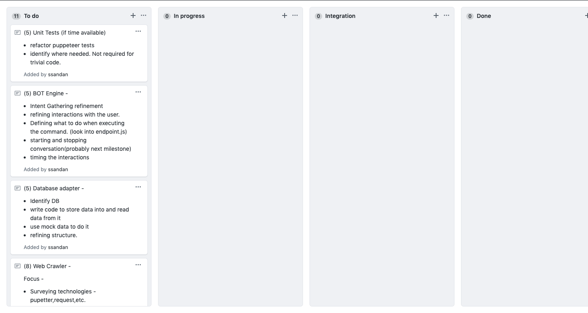
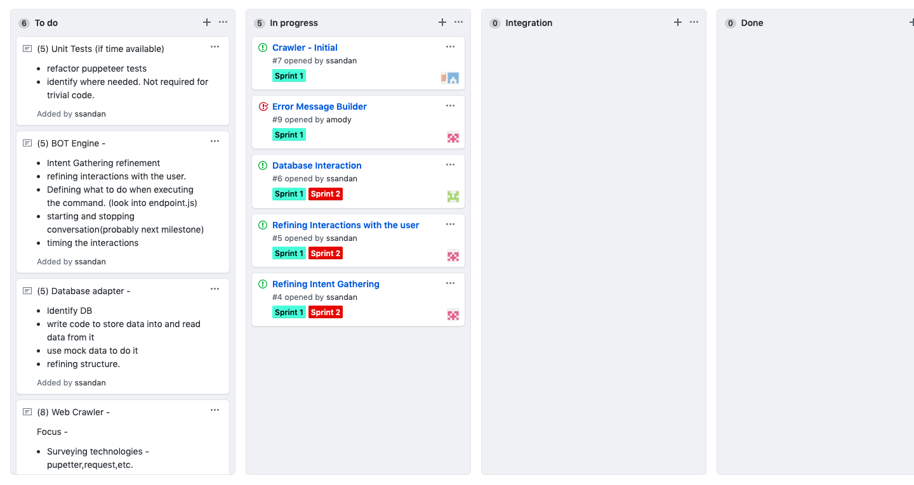
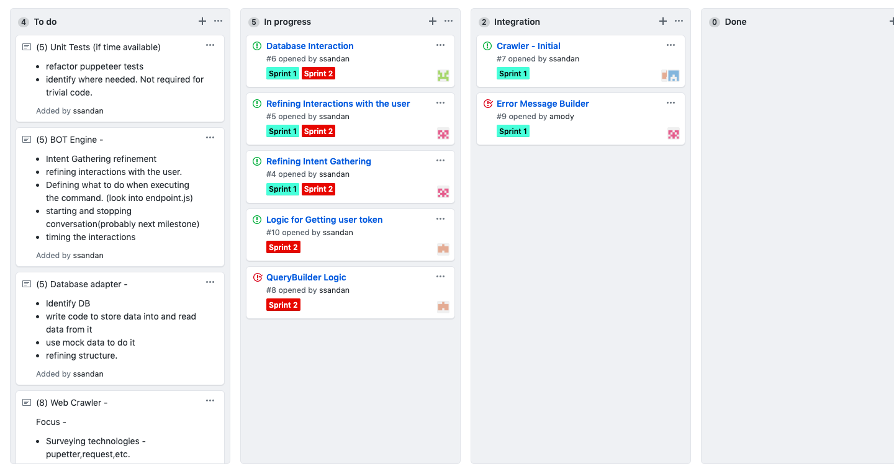
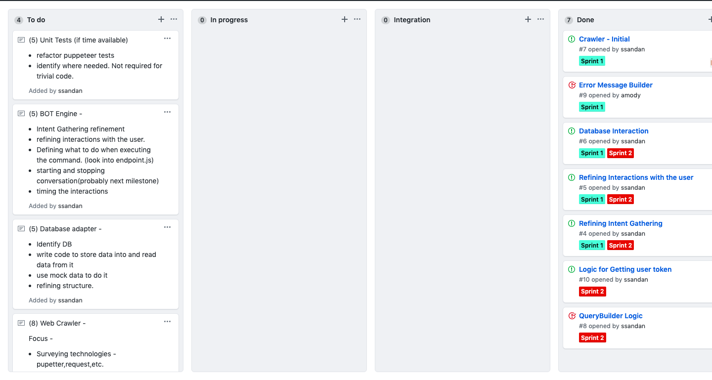

# Milestone: PROCESS

## Process

Software development is a complex process involving a number of people, therefore to carefully plan and delegate the tasks equally among all the team members we used Kanban board(Github Project) to keep track of the work.

We developed our software in 2 short iterations:

1. Wed Oct 23 -- Fri Nov 1

* At the beginning of Sprint 1, we divided the use cases into stories needed to be done over the duration of these 2 iterations and also assigned story points depending upon the amount of time required to complete that story.

* Once the stories were defined, we created tasks and assigned them equally among all the members.
Tasks Identified:

  * Web crawler
  * Database Interaction
  * Error message builder
  * QueryBuilder Logic
  * Refining interactions with user
  * Refining intent gathering
  * Logic for getting user token
 
 At the initial stage of Sprint 1, Kanban board looked like this:

  
  2. Sat Nov 2--Fri Nov 8th
  
  * At the beginning of Sprint 2, tasks for Sprint 1 were already completed and others were still in process.
  
  
  
  * After the completion of both the iterations, the tasks completed were marked "Done".
  
  
  
  ## Practices
  
  We followed a "scrumban" methodology, that is a blend of kanban and scrum practices.
  
  * **Core Practices**
  
     * Pair Programming: Earlier everyone used to work individually on the assigned tasks, but for these iterations we involved Pair Programming practice and could immediately see the results. We effectively got continuous code review and quicker solutions to nagging problems which otherwise would have been impossible for one person. Sourabh and Juhi worked on the Web crawler task together while Ankit and Abhilasha worked to integrate the exisitng code and database interactions. During the first iteration Abhilasha worked on configuring the initial MongoDB database connection and interactions which was pushed on a separate branch. And then we did pair programming during the second iteration to integrate the database into the bot which was initially using mock data. 
     
     * Weekly Cycle: Weekly cycle means the development is done in weekly iterations. The team met on the first day of the week to reflect on progress to date, picked on the stories to be completed in that week, and determined how to approach the stories. The goal by the end of the week was to have running tested features that realized the selected stories. Earlier development was being performed in a random fashion and tasks were not divided equally over the weeks.

     * Slack: The idea behind slack was to add some low priority tasks or stories in our weekly cycles that could be dropped if the team got behind on more important tasks or stories. We created a story for Unit Tests and the sole purpose of doing this was to account for the variability in estimates to make sure we leave ourselves a good chance of meeting the forecasts.
     
  * **Corollary Practices**
  
     * Single Code Base: For continuous integration, maintaining a single code base is important. Branches can exist for sometime, but should be brought together through frequent integrations.
     
     * Shared code: Having worked on the project since the beginning of the semester, there is now a sense of collective responsibility, anyone on the team can improve any part of the sytem at any time. The pre-requisite to apply this practice was adoption of teamwide coding practices.
